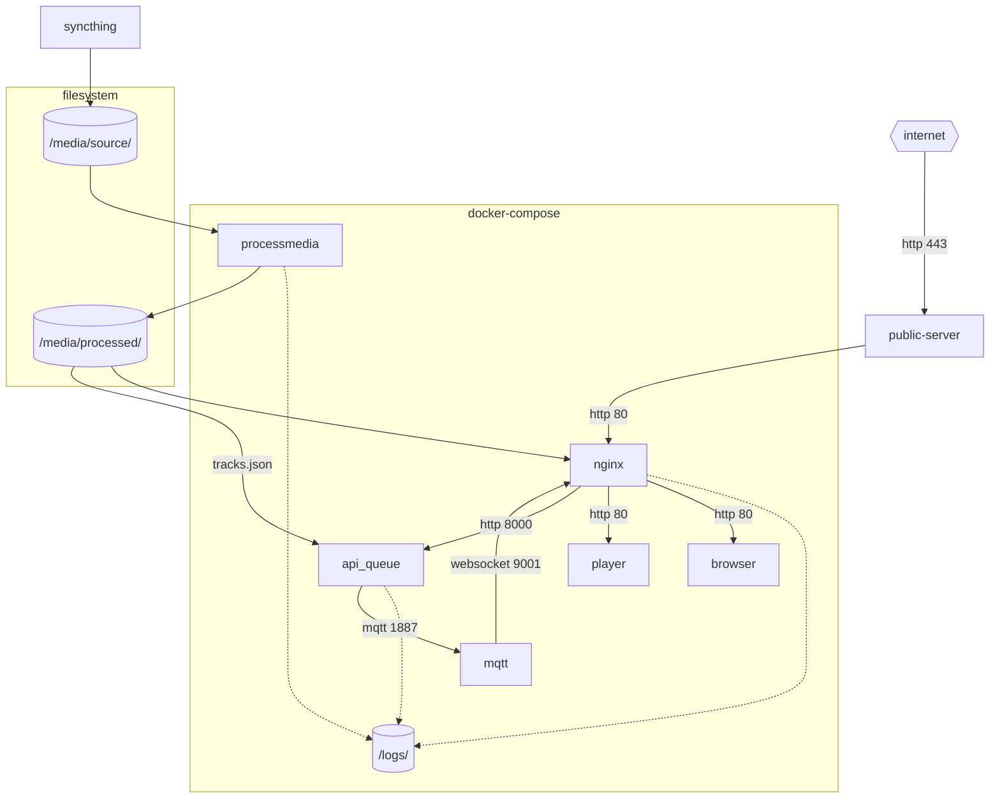

KaraKara
========

Karaoke Event System - hosted at [karakara.uk](http://karakara.uk/)

* Run small events in your livingroom or big events with multiple karaoke rooms
* Attendees view and queue tracks from their mobile phones
* A Projector/TV shows a HTML5 player
* Internet connection is required


Overview of a karaoke event
---------------------------

* A projector is fired up in a dimly lit room and a microphone stands ready on the mic stand. The PA is buzzing lightly. The attendees slowly enter the room. But this time is different. Attendees see advertised on the projector and "Join at `karakara.uk` room `eventname`" and a QRcode. A mobile / tablet / laptop interface to browse, search, see preview videos of tracks, lists of lyrics, see the current queued tracks with estimated times. Attendees can queue a track themselves. Pass the device to a friend to browse and queue a track under a different name.
* A laptop at the front is connected to the projector. It is running a `karakara.uk` with a pre-processed tagged dataset of tracks in various formats.
* Admins can walk around the room, remotely controlling when tracks are played fullscreen, re-ordering tracks, viewing feedback from attendees. Yet a desk at the front is still taking face to face song requests.


Headline Feature Descriptions
-----------------------------

* Track tagging with multiple exploration paths
    * Rather than just browsing tracks by title, tracks are surfaceable via different routes because they are tagged. e.g:
        * Tracks are in different *languages*. Singers not comfortable with Japanese can select English.
        * Tracks can be listed under multiple *titles*. English and Japanese names.
        * *Vocal style*; female, male, group
        * *track type*; short version, instrumental, full version, megamix version
        * *artist*
    * Tags are cumulative filters e.g.
        * english, group, anime
        * jpop, artist: bob
        * vocal-less, short, male
* Queue obfuscation and segmentation
    * We want users to know if they will be performing soon (configurable number of next tracks is displayed to users).
        * Imagine:
            * We provide attendees with the entire queue list with estimated times
            * an administrator identifies 3 long boring slow songs queued in sequence and decides to reorder the playlist slightly to assist the flow / mood of the event.
            * Some users could see they have been put back a few tracks and become disgruntled (because of course it's their right to queue a track, how dare their sacred performance be postponed for lesser mortals).
    * All later tracks are displayed in a deliberate random/obfuscated order. Users can see there track is queued/acknowledged, yet provides admins with curated control.
* Notable Settings
    * Event end (and start) times
        * We don't want to knowingly allow users to queue tracks to 12:30 when we know the event will be finishing at 12:00. That would lead to lots of disappointed people.
    * Optional: Allowed performer name list
        * A configurable list of allowed performer names can be provided
        * Performer 'bob' can't queue more than 2 tracks within a time-period
    * Automatic queued track reordering
        * WIP - not testing with a real audience yet.
        * The next X tracks are set in stone - everything after that is ordered based on duplicate performers and a song duration time.
    * Track repeat limit
        * Limit how many times a single track can be queued within a time-period. (We don't want 5 Pokemon's in one evening)
* Audio Normalization
    * During processing sound levels are normalized. Some tracks could be slow quiet ballads while others or ripping metal operas. Technical admins needed to often adjust the volume of the microphone at the beginning of a song to compensate for the track volume differences. While normalization does not remove the problem (as different vocalists will use the mic in different ways), it does reduce the problem.
* Wide variety of video/audio/subtitle formats supported
    * Originally videos with subtitle files was the only way to add a track. Some vocal-less versions of the track are published or full length version that are longer than the 1:30 original intro. To facilitate this, the following formats are supported
    * Image + Audio + Subtitle
    * Video + Subtitle
    * Hard-subbed Video
        * Various formats and codecs (including RM, gah!)


Developer setup (local machine)
---------------

TODO: refine

See [getting-started.md](docs/getting-started.md) for a tour and description

Configure site settings (eg which folders contain your media):
```
$ cp .env.example .env
```
Then edit settings in .env

Then build and run the software:
```console
$ docker compose build
$ docker compose up
```


Core components
---------------





* [api_queue](api_queue/README.md) 
  * An API for managing queues
  * Users can add tracks to the queue
  * Tracks will be validated to make sure one user isn't filling the whole queue, and nobody can add tracks past the end of the event time limit
  * Admins can re-order and delete tracks
* [processmedia3](processmedia2/README.md) 
  * Takes folders of source data (video, image+audio, subtitles)
  * Create high-bitrate video for the player interface.
  * Create low-bitrate previews for mobile devices
  * Create thumbnail images for the track browser
  * Convert subtitles into a format that web browsers understand
  * Export an index of all the created files and metadata into `tracks.json`
* [browser3](browser3/README.md) 
  * Mobile webapp interface to search / preview / queue tracks
  * Gets data from `tracks.json`
* [player3](player3/README.md) 
  * Displays the current queue for use on a projector
  * Gets data from website / `queue` api
  * Streams final video from `nginx` in fullscreen mode.
  * Automatically updates track list when the queue is changed.
  * Queue order is obscured past a configurable time


History
-------

* Each component has been re-written and refined multiple times since it's inception in 2012
* When the project was started we could not rely on a venues reliable free wifi and 4g didn't exist. A physical server and wireless router were needed in the room. Since then the project has evolved to be 'Karaoke as a service' run on an external webserver.
