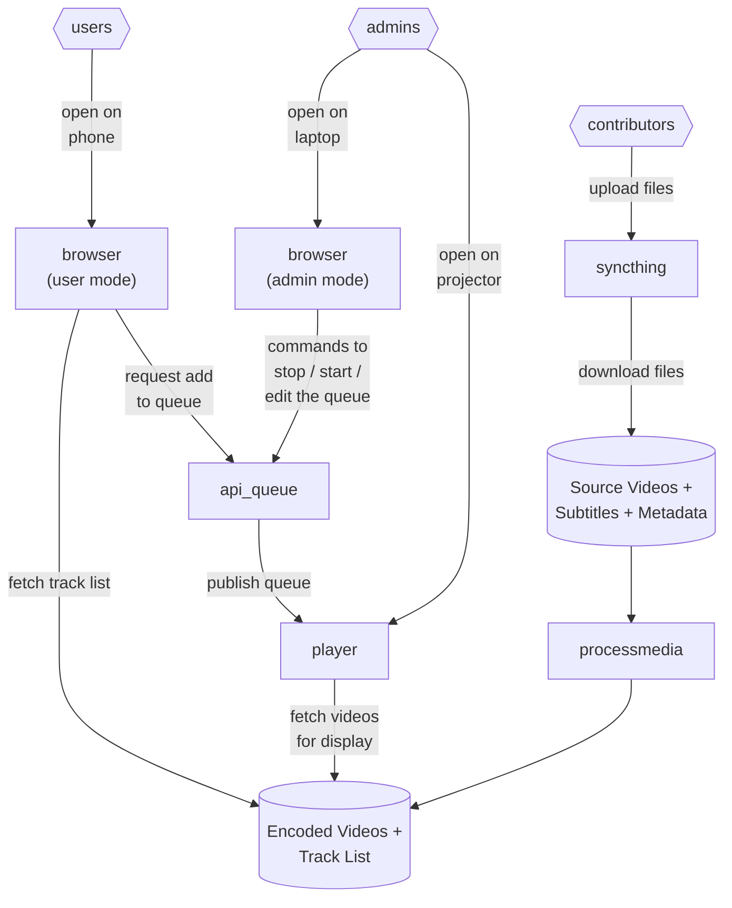

# Get Started Running Events

## Types of Event

### Big Hall Mode
Hundreds of people in a convention hall, with a projector screen and a microphone on stage.

Suggested Hardware:
* A projector for videos
* A PA system for sounds
* A set of microphones on stage
* A tablet on a podium for singers to see their lyrics while facing the audience
* A mixing desk to balance the microphone and music volume
* A laptop for running the player
* A phone or laptop for each admin to control the queue
* A phone for each user to browse and add tracks to the queue
* A desk for admins to sit at where they can take requests from users
  * Pretty much all users can figure out how to use their phone to add tracks to the queue
  * But it's useful to have a human for requests like "please postpone this track while I go to the bathroom"

### Karaoke Booth / Living-Room Mode
People can book a room for an hour for themselves and a few friends, and use the system to queue tracks and sing along.

Suggested Hardware:
* A TV with speakers for music and lyrics
* A laptop plugged into the TV
  * Browser full-screen on the laptop screen, logged in as admin with "Booth mode" enabled
  * Player full-screen on the TV
* Microphone(s) plugged into a karaoke speaker
* Alternatively, microphone(s) plugged into a HDMI-mixer to use the TV's speakers

## Component Diagram

## Event Setup

### Load the Track Browser
* On a phone or laptop - https://karakara.uk/
* By default this will be in user-mode, which allows browsing and adding tracks to the queue
* Double-click title banner for settings, and to switch to admin-mode
  * room: test, password: test
* "Booth mode" is useful to leave running on an unattended karaoke kiosk -- it gives people some admin features (eg. stopping and starting the playback) but not all of them (eg. editing room settings)

### Set Settings
* With the browser in admin-mode, from the main screen ("Explore Tracks") click "Room Settings"
  * track space: the time between finishing one track and playing the next, to give people time to get on and off stage
  * hidden tags: tracks with these tags won't be visible for users to select
  * forced tags: only tracks with these tags will be visible for users to select
  * title: the event name, shown on the projector while waiting for the first track
  * preview volume: the volume of the player preview in-between tracks
  * coming soon track count: show the exact order for the next N tracks, and obfuscate the rest of the queue to give admins more leeway to reorder the queue
  * event start and end time: prevent users from adding tracks that would finish after the event ends
  * performer names: if set, users can only add tracks with these performer names (eg to make sure each track is associated with somebody from the convention signup list)

### Load the Queue Player
* On a laptop connected to TV or projector screen - https://karakara.uk/player3/
* double click anywhere for settings
  * room: test, password: test
  * "Podium mode" shows just the lyrics - useful to stick on a tablet on a podium for singers to see their lyrics while facing the audience (otherwise singers tend to sing while facing the projector screen)
  * "Sync" shows how in-sync the projector-view and podium-view are. Ideally the label should be changing to the same colour at the same moment on both screens. If they are out-of-sync by more than a fraction of a second, having the lyrics appear at the wrong time is disorienting for singers.
  * "WakeLock" shows whether or not the browser has been able to disable the screensaver. If this is not working, the screen may go to sleep during an event, which is not ideal.
  * "Underscan" can be useful to adjust the video size to fit the projector screen. Some projectors and TVs are mis-configured in a way that causes the content to be stretched beyond the edges of the screen - This setting can be used to shrink the video slightly to make sure nothing important is cut off.
    * This setting is a CSS "padding" command, so you can use values like:
      * `5%` - make the screen 5% smaller on all sides
      * `10px 20px` - make the screen 10 pixels smaller top and bottom, 20 pixels smaller left and right
