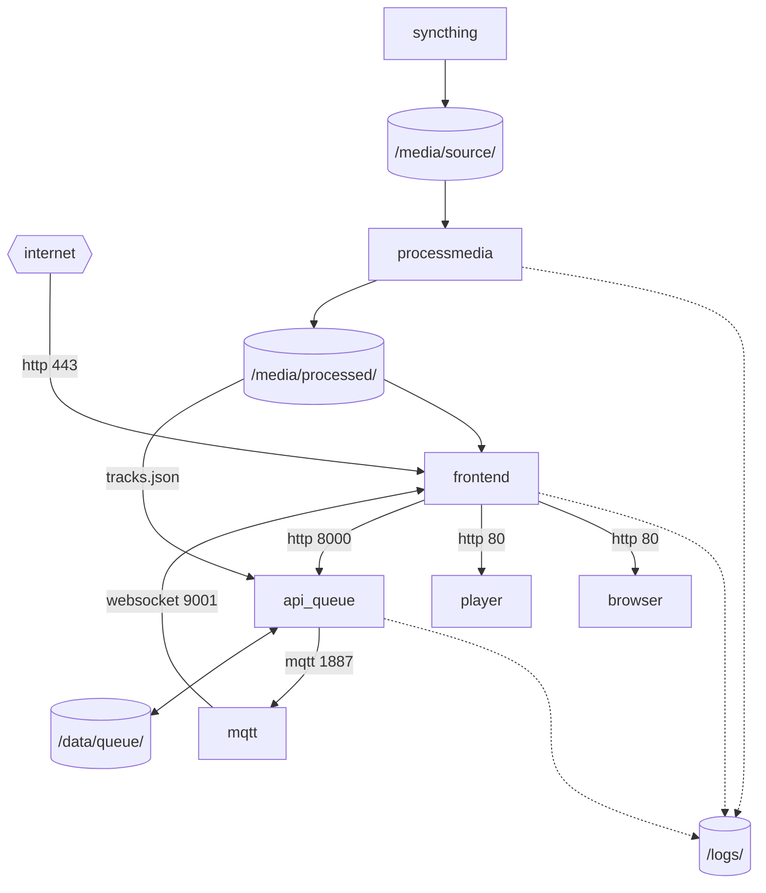

# Get Started Developing KaraKara

## Install Locally or in the Cloud

### Cloud
* https://codespaces.new/calaldees/KaraKara?quickstart=1
* https://gitpod.io/#https://github.com/calaldees/KaraKara

### Local
```bash
git clone https://github.com/calaldees/KaraKara.git
cd KaraKara
```

## Run
```bash
python3 processmedia3/get_example_media.py
cp .env.example .env
docker compose up --detach --build
docker compose logs
```
* see encoding progress in docker terminal
* wait for example media to finish encoding
* Navigate to `http://localhost:8000/browser3/test` to see the track list
* Navigate to `http://localhost:8000/player3/test` to see the player

## Component Diagram



## Develop

* Edit code in your IDE
* Rebuild and rerun with `docker compose up --detach --build`
* Note that while docker is the simplest and most reliable way to get up and running, it can be slow to rebuild
* For faster iteration, you can run components directly on your host machine - the process for this is different for each component, and will be documented in each component's README file
  * [processmedia3](../processmedia3/README.md)
  * [browser3](../browser3/README.md)
  * [api_queue](../api_queue/README.md)
  * [player3](../player3/README.md)
